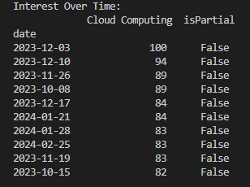

# Google Search Analysis 2023

This project involves analyzing Google search trends using the `pytrends` library. The analysis focuses on the search term "Cloud Computing" and includes several visualizations that highlight search interest across different regions and time periods, as well as the top Google search trends for 2023.

## 1. Interest Over Time

### Description
The table below shows the top 10 periods with the highest search interest for "Cloud Computing." It highlights when the topic was most popular over the last year.

### Visualization


## 2. Interest By Region

### Description
This bar chart visualizes the interest in "Cloud Computing" across different regions. It shows the top 10 regions with the highest search interest, giving insights into geographic trends.

### Visualization


## 3. Top Charts of 2023

### Description
The table below lists the top 10 Google search trends of 2023. It provides a snapshot of the most searched topics globally during the year.

### Visualization


## Conclusion

This README provides a summary of the visualizations created for this Google search trend analysis. The figures represent specific aspects of the data, such as the popularity of "Cloud Computing" over time and across regions, and the overall top search trends for 2023.

## How to Run

If you would like to replicate the analysis, follow these steps:
1. Clone the repository.
2. Install the necessary dependencies using:
   ```bash
   pip install pandas pytrends matplotlib
